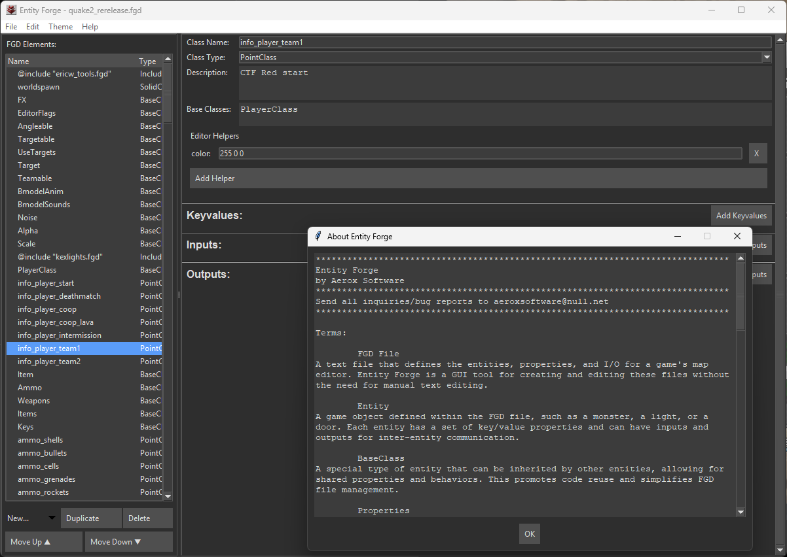

<center>
<h1/>:: Entity Forge ::
</center>

##### A Modern FGD Editor

Welcome to Entity Forge! This is a simple, modern desktop application designed to make creating and editing `.fgd` (Forge Game Data) files an intuitive and enjoyable experience. Whether you're a seasoned map maker or just starting out with Hammer, Entity Forge provides a clean, user-friendly interface to manage your entity definitions without the hassle of manual text editing.

Head over to the **Releases** tab to catch the newest binary! (Windows only)

---

As of **Version 0.6**, a dark mode **AND** light mode are now available and working!

---



<center>
<h5/>Working screenshot of Editor Window with Help Panel.
</center>

---

## How It Works

Entity Forge is built with Python and utilizes a modular design to handle all aspects of FGD file management. The program is composed of three core logic components and a graphical user interface (GUI) to provide a seamless workflow.

- **The Parser (`fgd_parser.py`):** When you open an FGD file, the parser intelligently reads the text content and converts it into a structured data model that the program can understand and manipulate.

- **The Data Model (`fgd_model.py`):** This is the program's "brain." It defines the various components of an FGD file—such as entity classes, properties, inputs, and outputs—as organized objects. This allows the GUI to display and modify the information easily.

- **The Serializer (`fgd_serializer.py`):** After you've made your changes, the serializer takes the structured data from the model and writes it back to a clean, correctly formatted FGD file, ready for use in your game editor.

- **The GUI (`fgd_gui.py`):** The front end of the application, built with `tkinter`, provides an interactive environment to view, create, and modify FGD elements. It's the part you'll see and interact with, handling everything from opening files to editing individual properties.
  
  

---

## How to Use It

### Getting Started

1. Ensure you have a modern Python installation (e.g., Python 3.9+) on your system.

2. Install the necessary dependencies. Entity Forge uses standard Python libraries, so no additional installations should be required.

3. Run the application by executing `main.py` from your terminal:
   
   Bash
   
   ```
   python main.py
   ```

---

### Basic Workflow

- **Open a File:** Go to `File > Open` to load an existing `.fgd` file. The program will parse its contents and display a list of all defined classes and directives on the left-hand side.

- **Create a New File:** If you're starting from scratch, select `File > New` to begin with an empty canvas.

- **Add an Entity Class:** Click the "New Class" button to create a new entity (e.g., a `PointClass` or a `SolidClass`). Give it a name, and it will appear in the list.

- **Edit an Element:** Select any element from the list to view and edit its details, including its name, description, properties, and I/O (Inputs/Outputs).

- **Add Properties and I/O:** Within the properties pane, you can add new keyvalues, inputs, or outputs to a class. The GUI supports different property types like `string`, `choices`, and `flags`, with dedicated interfaces for each.

- **Save Your Work:** Use `File > Save` to save changes to the current file or `File > Save As...` to save it to a new location.
